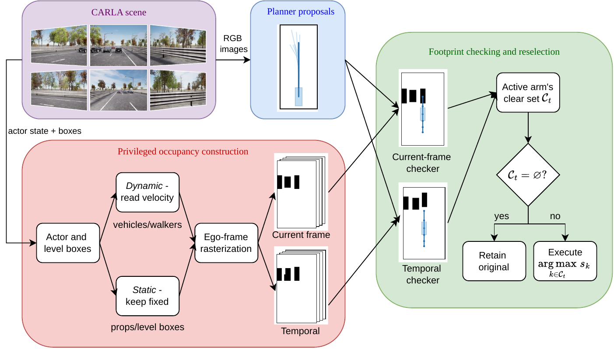
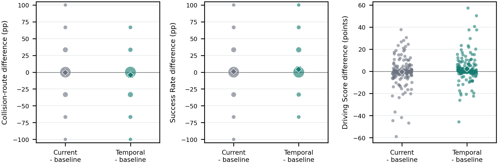
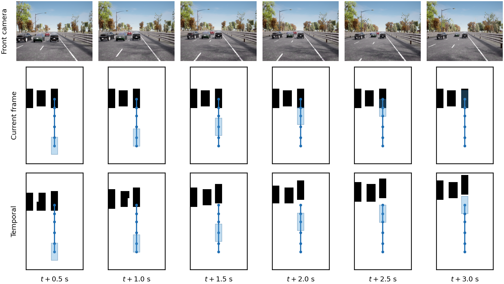

<div align="center">

### Evaluating Privileged Occupancy Filtering for Fixed-Vocabulary End-to-End Driving

[Soham Das](https://openreview.net/profile?id=~Soham_Das3)<sup>1,2</sup>

<sup>1</sup> University of Cincinnati, Cincinnati, Ohio, USA<br>
<sup>2</sup> Advanced Control & System Integration Laboratory, Department of
Automatic Control Engineering, Feng Chia University, Taichung, Taiwan

[](https://github.com/das2sm/HyDrive/actions/workflows/ci.yml)
[](requirements-analysis.txt)
[](LICENSE)

</div>

This work asks whether privileged occupancy is actionable through the
proposal-selection interface of an unchanged score-and-select driving planner.
It compares unmodified SparseDriveV2, current-frame occupancy filtering, and
temporally aligned occupancy filtering in closed-loop Fail2Drive evaluation.

<p align="center">
  
</p>

## Results

| Condition | Collision routes | Route completion | Driving Score |
| :--- | ---: | ---: | ---: |
| Baseline | 241/555 (43.4%) | 93.6 | 49.8 |
| Current-frame filter | 239/555 (43.1%) | 92.4 | 49.4 |
| **Temporal filter** | **219/555 (39.5%)** | **94.2** | **51.9** |

Temporal filtering differs from baseline by **-4.0 percentage points** in
collision-route incidence (95% route-family cluster-bootstrap CI
[-7.7, -0.4]).

<p align="center">
  
</p>

## Occupancy Comparison

Current-frame filtering repeats the present occupancy grid at every planner
horizon. Temporal filtering instead propagates dynamic actors with a
constant-velocity, fixed-yaw model and aligns one grid to each of the six
planner waypoint times.

<p align="center">
  
</p>

The occupancy is derived from privileged CARLA state. This isolates whether
future-scene information can affect decisions through reselection.

## Quick Verification

The reported statistics can be reproduced without CARLA, a GPU, or a model
checkpoint. The lightweight verifier supports Python 3.8--3.13; the dependency
file selects compatible NumPy and Matplotlib versions automatically:

```bash
git clone https://github.com/das2sm/HyDrive.git
cd HyDrive

python3 -m venv .venv
source .venv/bin/activate
python -m pip install --upgrade pip
python -m pip install -r requirements-analysis.txt

python analysis/verify_artifact.py
pytest -q
```

To independently recompute every reported 20,000-resample confidence interval:

```bash
python analysis/verify_artifact.py --full-bootstrap
```

## Repository Structure

| Path | Contents |
| :--- | :--- |
| [`intervention/`](intervention) | Occupancy construction, footprint checking, selection, agent, and logging code |
| [`runtime/`](runtime) | Isolated-job campaign preparation, execution, cleanup, and finalization |
| [`analysis/`](analysis) | Statistical analysis and independent verification |
| [`data/`](data) | Complete route-arm-seed outcomes, schedule, contrasts, and result registry |
| [`configs/`](configs) | Route manifests and sanitized protocol template |
| [`figures/`](figures) | Figure-generation code and vector overview asset |
| [`visualization/`](visualization) | Default-off qualitative capture and the development-only Figure 2 snapshot |
| [`patches/`](patches) | SparseDriveV2 planner-output and Fail2Drive campaign-control patches |
| [`docs/`](docs) | Setup and campaign reconstruction guides |

## Reproduction

### Reproduce the paper statistics

Use the quick and full-verification commands above. This path operates on the
included outcome artifact and requires only Python and NumPy.

### Reconstruct the closed-loop campaign

Full reconstruction requires Linux, an NVIDIA GPU, CARLA 0.9.15,
SparseDriveV2 and its stage-two checkpoint, and the Fail2Drive integration.
See [`docs/SETUP.md`](docs/SETUP.md) and
[`docs/RUN_CAMPAIGN.md`](docs/RUN_CAMPAIGN.md).

The checkpoint, CARLA distribution, and raw simulator logs are not
redistributed. Their identities and the campaign runtime versions are recorded
in [`provenance.json`](provenance.json) and
[`environment.json`](environment.json).

## Data and Provenance

- [`data/job_outcomes.csv`](data/job_outcomes.csv) contains all 1,665 accepted
  benchmark outcomes used in the paper.
- [`data/schedule.csv`](data/schedule.csv) records the pre-generated,
  counterbalanced execution order.
- [`data/results_registry.json`](data/results_registry.json) contains the
  paper-facing estimates and confidence intervals.
- [`data/contrast_table.csv`](data/contrast_table.csv) provides the reported
  metric contrasts in a flat table.
- [`MANIFEST.sha256`](MANIFEST.sha256) provides integrity hashes for the
  protocol, data, campaign code, analysis code, and provenance.
  Public-facing documentation and repository-maintenance files are excluded.
- [`PROTOCOL.md`](PROTOCOL.md) records the evaluation design, endpoints, estimator,
  and interpretation rules.

The 185 evaluation routes form 97 bootstrap families: 88 matched
Base/Generalization pairs and nine singleton Generalization routes whose Base
counterparts belong to the separate development split.

No route was excluded and no accepted job required a retry.

## Acknowledgements

HyDrive builds on
[SparseDriveV2](https://github.com/swc-17/SparseDriveV2),
[Fail2Drive](https://github.com/autonomousvision/fail2drive),
[Bench2Drive](https://github.com/Thinklab-SJTU/Bench2Drive), and
[CARLA](https://github.com/carla-simulator/carla). Upstream-derived files remain
subject to their original licenses and notices.

## License

Original HyDrive code and documentation are released under the
[MIT License](LICENSE). See [`THIRD_PARTY_NOTICES.md`](THIRD_PARTY_NOTICES.md)
and [`licenses/`](licenses) for upstream notices.
